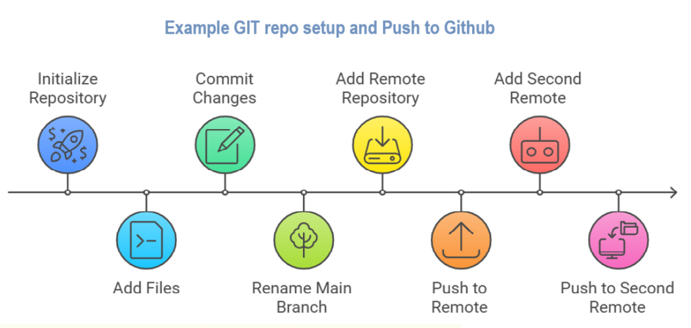
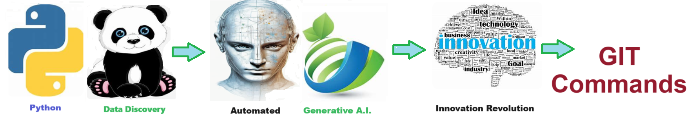

# Git Commands - Git allows you to quickly download pre-built solutions  
Git allows you to quickly download pre-built solutions  

## Git Version Control
- **Git** is a distributed **version control system** designed to track changes in source code during software development.
- **Git** allows multiple developers to **collaborate**, manage different versions, and merge their work seamlessly.
- **Git** enables efficient **code management**, fosters collaboration, and ensures the integrity and history of a projects development.

## Solution Features
- Easy to understand and use  
- Easily Configurable 
- Quickly start your project with pre-built templates
- Its Fast and Automated

## Notebook Features
- **Self Documenting** - Automatically identifes major steps in notebook 
- **Self Testing** - Unit Testing for each function
- **Easily Configurable** - Easily modify with **config.INI** - keyname value pairs
- **Includes Talking Code** - The code explains itself 
- **Self Logging** - Enhanced python standard logging   
- **Self Debugging** - Enhanced python standard debugging
- **Low Code** - or - No Code  - Most solutions are under 50 lines of code
- **Educational** - Includes educational dialogue and background material
    
## Getting Started
To get started with the **Git Commands** solution repository, follow these steps:
1. Clone the repository to your local machine.
2. Install the required dependencies listed at the top of the notebook.
3. Explore the example code provided in the repository and experiment.
4. Run the notebook and make it your own - **EASY !**
    

## Github    
## https://github.com/JoeEberle/ 

## Email 
## josepheberle@outlook.com 

    

    ## Deliverables or Figures      